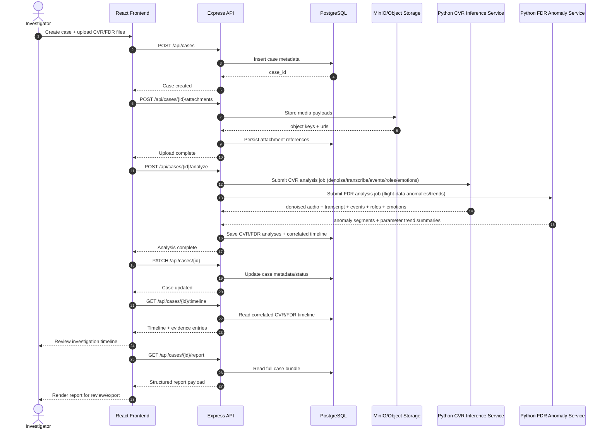
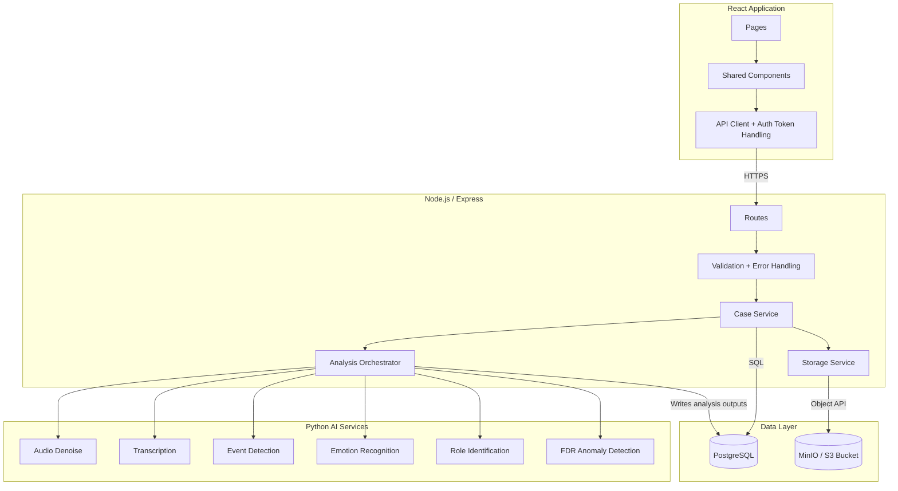

# Architecture Diagrams

This document provides ready-to-edit Mermaid diagrams that explain the system from two viewpoints:

1. **Sequence diagram** - how a typical investigator request flows across modules.
2. **Module collaboration diagram** - how frontend, backend, and AI services connect.

You can paste these blocks into Mermaid Live Editor, GitHub Markdown, or export them locally with Mermaid CLI.

Scope reflected in the diagrams:
- Single user role: `Investigator`
- Case lifecycle: create case, upload files, manage/review case timeline, generate report
- CVR pipeline: denoise, transcribe, event detection, role identification, emotion recognition
- FDR pipeline: anomaly detection and parameter trend analysis

## 1) Sequence Diagram (Case Ingestion to Report)



## 2) Module Collaboration Diagram



## Export as Images

```bash
# Best quality: vector output (no pixelation)
npx -y @mermaid-js/mermaid-cli -i docs/docs/architecture-diagrams.md -o docs/docs/architecture-diagrams.svg

# High-resolution PNG (4x scale)
npx -y @mermaid-js/mermaid-cli -i docs/docs/architecture-diagrams.md -o docs/docs/architecture-diagrams@4x.png -w 3200 -H 2200 -s 4
```

When exporting from a Markdown file with multiple Mermaid blocks, Mermaid CLI writes numbered outputs such as:
- `docs/docs/architecture-diagrams-1.svg`, `docs/docs/architecture-diagrams-2.svg`
- `docs/docs/architecture-diagrams@4x-1.png`, `docs/docs/architecture-diagrams@4x-2.png`
